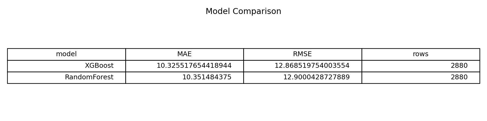
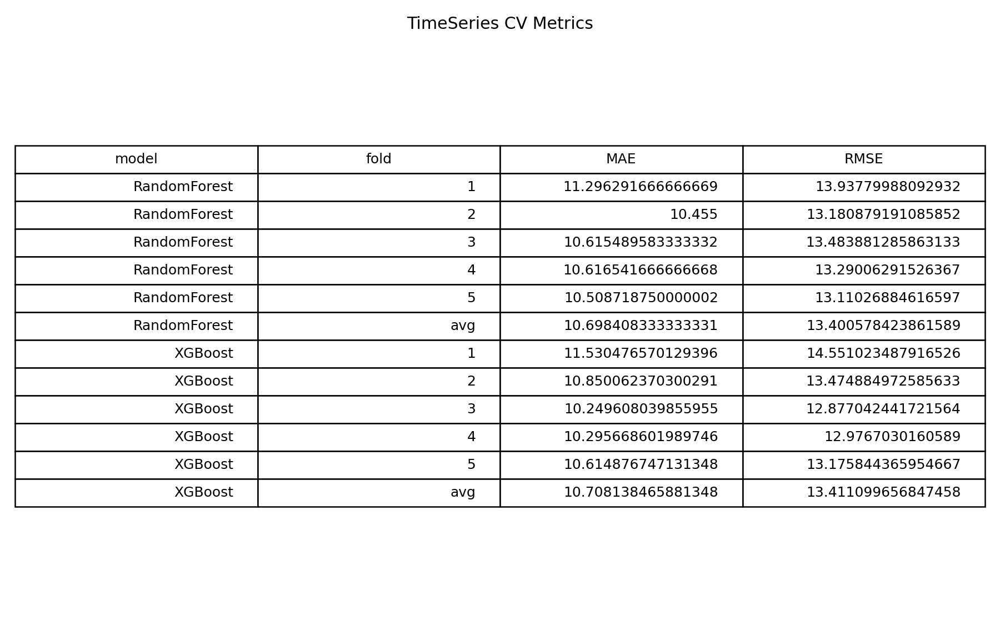
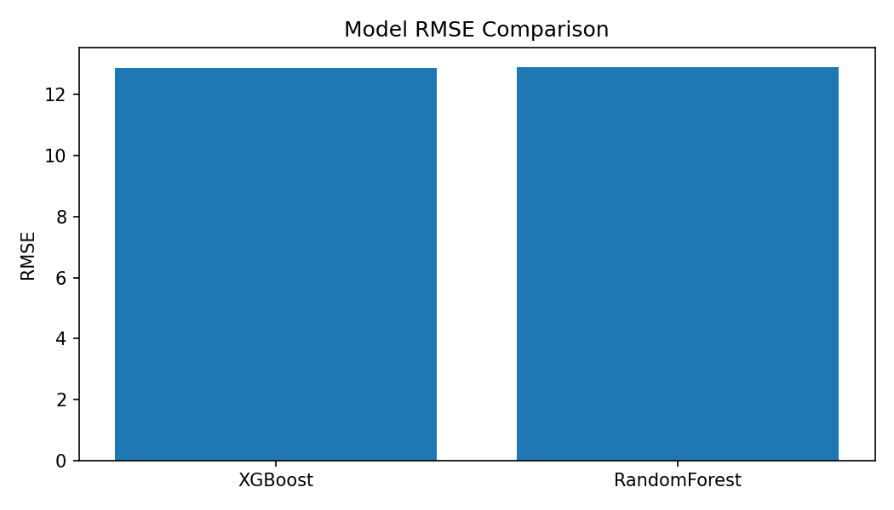
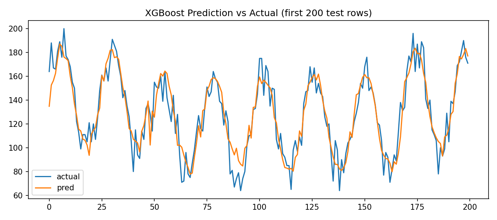

# taxi-demand-forecast


NYC Taxi 수요를 시간 단위로 예측하는 **시계열 ML 프로젝트**입니다.  
단순 모델 학습을 넘어, **비교 실험 + 교차검증 + 시각화 + API 서빙**까지 포함합니다.

---

## 1) 프로젝트 목표

- 시간대별 택시 수요(`trip_count`) 예측
- RandomForest / XGBoost 성능 비교
- 결과를 대시보드로 시각화하고 API로 재사용

---

## 2) 핵심 포인트

- **모델 비교**: RandomForest vs XGBoost
- **평가 지표**: MAE, RMSE
- **시간순 분할**: 시계열 특성을 반영한 split
- **교차검증**: `TimeSeriesSplit(n_splits=5)`
- **서빙**: Streamlit + FastAPI

---

## 3) Quick Start (Windows PowerShell)

```powershell
python -m venv .venv
.\.venv\Scripts\Activate.ps1
pip install -r requirements.txt
python src\train_baseline.py
```

원본 CSV(raw)가 있을 때:

```powershell
python src\prepare_data.py
python src\train_baseline.py
```

대시보드 실행:

```powershell
streamlit run app.py
```

API 실행:

```powershell
uvicorn src.predict_api:app --reload
```

---

## 4) 프로젝트 구조

- `src/prepare_data.py` : raw → 학습 데이터 전처리
- `src/train_baseline.py` : 모델 학습/비교 + best model 저장
- `src/train_with_cv.py` : TimeSeriesSplit 교차검증
- `src/predict_api.py` : FastAPI 추론 API
- `app.py` : Streamlit dashboard
- `models/` : `best_model.pkl`, `feature_order.json`
- `reports/` : 비교표/그래프/실험 로그
- `docs/architecture.md` : 아키텍처 다이어그램

---

## 5) 입력/출력

### 입력(`data/train.csv` 최소 컬럼)
- `pickup_datetime` (datetime)
- `trip_count` (target)

### 주요 산출물
- `reports/model_comparison.csv`
- `reports/rmse_comparison.png`
- `reports/prediction_preview.png`
- `reports/cv_metrics.csv`
- `reports/experiment_log.md`
- `models/best_model.pkl`

---

## 6) API 예시

### `POST /predict`

요청:

```json
{
  "hour": 9,
  "dayofweek": 1,
  "month": 3,
  "day": 9
}
```

응답:

```json
{
  "model": "XGBoost",
  "features": {
    "hour": 9,
    "dayofweek": 1,
    "month": 3,
    "day": 9
  },
  "predicted_trip_count": 126.4832
}
```

---

## 7) 결과 화면






---

## 8) 코드 스니펫

### Feature Engineering

```python
df["hour"] = df["pickup_datetime"].dt.hour
df["dayofweek"] = df["pickup_datetime"].dt.dayofweek
df["month"] = df["pickup_datetime"].dt.month
df["day"] = df["pickup_datetime"].dt.day
```

### Time-based Split

```python
split_idx = int(len(df) * 0.8)
X_train, X_test = X.iloc[:split_idx], X.iloc[split_idx:]
y_train, y_test = y.iloc[:split_idx], y.iloc[split_idx:]
```

---

## 9) 한계와 다음 단계

### 현재 한계
- 시간 변수 중심 feature 위주
- 외부 변수(날씨/공휴일/이벤트) 미반영

### 다음 단계
- lag feature(1시간/24시간) 추가
- 외부 변수 결합
- 배포 후 모니터링 지표(지연/오차 드리프트) 추가

---

## 10) 테스트/CI

```powershell
pytest -q
```

GitHub Actions에서 push/PR 시 학습 스크립트와 기본 테스트를 자동 검증합니다.
